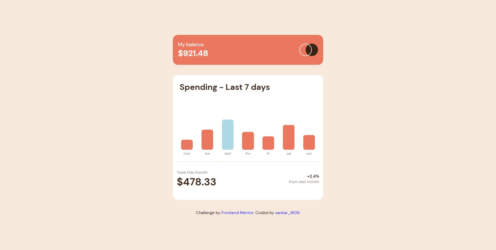

# Frontend Mentor - Expenses chart component solution

This is a solution to the [Expenses chart component challenge on Frontend Mentor](https://www.frontendmentor.io/challenges/expenses-chart-component-e7yJBUdjwt).

## Table of contents

- [Overview](#overview)
  - [The challenge](#the-challenge)
  - [Screenshot](#screenshot)
  - [Links](#links)
- [My process](#my-process)
  - [Built with](#built-with)
  - [What I learned](#what-i-learned)
  - [Continued development](#continued-development)
- [Author](#author)

## Overview

### The challenge

Users should be able to:

- View the bar chart and hover over the individual bars to see the correct amounts for each day
- See the current day’s bar highlighted in a different colour to the other bars
- View the optimal layout for the content depending on their device’s screen size
- See hover states for all interactive elements on the page
- **Bonus**: Use the JSON data file provided to dynamically size the bars on the chart

### Screenshot

### Links

- Solution URL: [solution URL](https://github.com/AkashKrish1609/expenses-chart-responsive-website)

## My process

### Built with

- HTML5 
- CSS custom properties
- Flexbox
- Javascript 

### What I learned

I used CSS flex property to align my website. Basic HTML properties. In the javascript section I used async function to fetch the data from data.json file and used it to mark the bar graphs correctly. To be specific I used forEach js function to get each elements from the data.json file and then manipulated css using DOM.

### Continued development

I still need to understand async, promises and fetch(). I have to know concepts in detail of the specified things.

## Author

- Frontend Mentor - [@AkashKrish1609](https://www.frontendmentor.io/profile/AkashKrish1609)
- Twitter - [@SANKAR_1609](https://twitter.com/SANKAR_1609)

